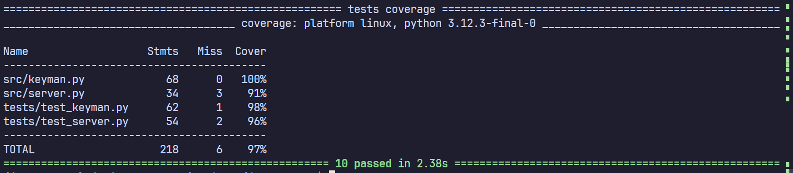
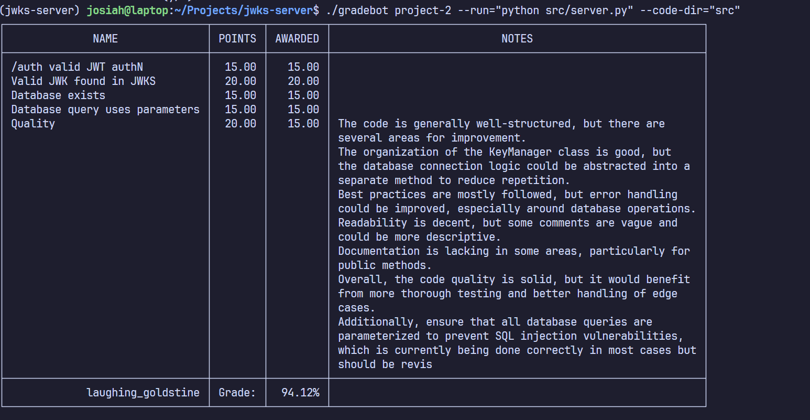

# JWKS Server
## Setup
For this program to run you must have python installed and be able to install the dependencies of the program,

To run the program install the dependincies in the requirements.txt:
``` bash
pip install -r requirements.txt
```

Then you can run the server with:
```bash
python src/server.py
```

## Unit Tests
There is about 96% of the code covered currently by unit test. The only section of code that isn't covered by tests currently is the key gen
There however is not much to test in the function as all it does is return keys that was generated.


## Grading
There appears to have been an issue in the gradebot as it was not authorized to connect to the server. Other than that I recieved all marks.

